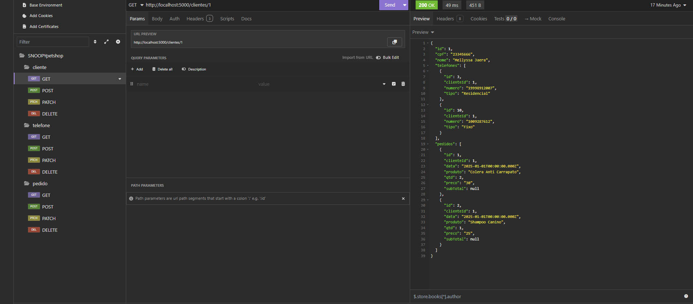
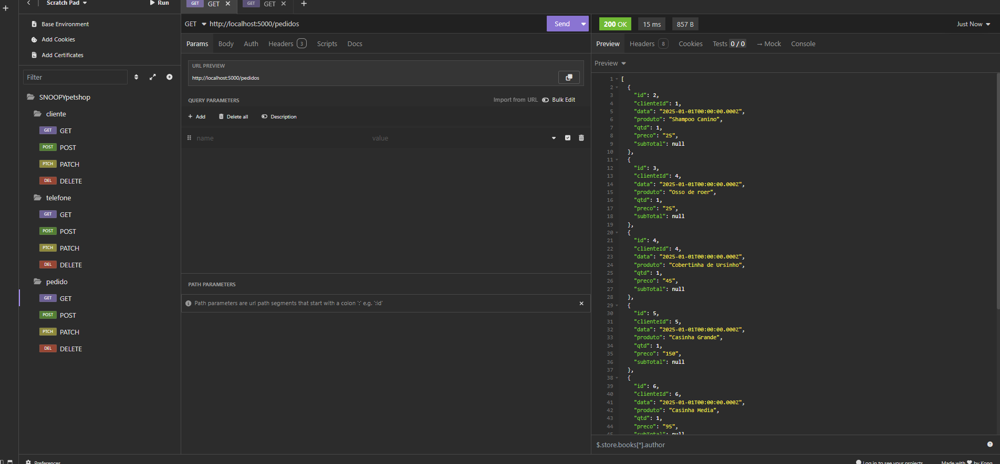
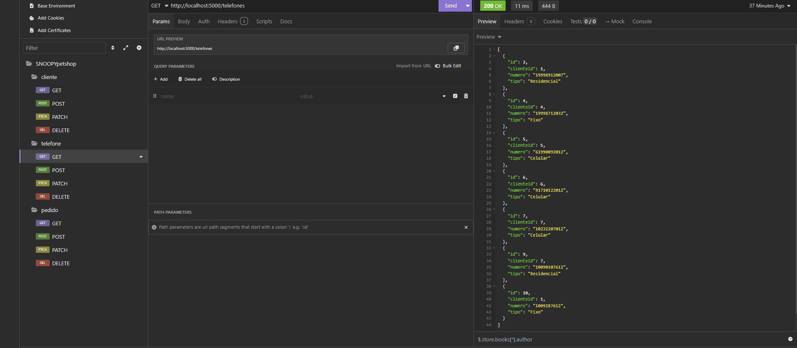

# SNOOPY PetShop API
Situação de Aprendizagem - Back-End (Node.JS, JavaSript, VsCode, ORM Prisma, Insomnia)
## Contextualização
SNOOPY PetShop tem atuado em nossa cidade com ótimo atendimento e agilidade, é nosso cliente e necessita de um sistema Web para registro dos seus pedidos no balcão.<br>O P.O. após uma visita ao cliente elaborou o DER e UML DC(Diagrama de Classes) a seguir e elencou os requisitos funcionais.<br>

## Desafio
Desenvolver as funcionalidades conforme requisitos

### Requisitos funcionais
- [RF001] O sistema deve permitir o CRUD de Clientes.
    - [RF001.1] O sistema deve permitir o CRUD de telefones, pois cada cliente pode possuir 0 ou vários telefones de tipos diferentes como celular, fixo ou comercial.
    - [RF001.2] A rota **read** do cliente deve mostrar os dados de todos os clientes e seus respectivos telefones.
    - [RF001.3] A rota **readOne** do cliente deve mostrar os dados de um cliente específico, seus telefones e seus pedidos.
- [RF002] O sistema deve permitir o CRUD de pedidos.
    - [RF002.1] O sistema deve associar o pedido a um cliente.
    - [RF002.2] Ao cadastrar um novo pedido **create** no controller sistema calcular o subTotal multiplicando o preco pela quantidade.

### Casos de teste (Insomnia)
- [CT001] Deve ser cadastrado pelo menos 5 clientes.
- [CT002] Deve ser cadastrado ao menos 1 telefone para cada cliente.
    - [CT002.1] Pelo menos dois clientes devem ter dois ou mais telefones cadastrados.
- [CT003] Cadastre, altere e exclua um cliente.
- [CT004] Cadastre um pedido para cada cliente.
    - [CT004.1] Pelo menos um cliente deve ter dois ou mais pedidos cadastrados.
- [CT005] Cadastre, altere e exclua um pedido.

## Tecnologias

- Node.JS (FRAMEWORK)
- VsCode (IDE)
- Prisma (ORM)
- Insomnia (TESTES)
- Xampp (SGBD)
## Passo a Passo de como executar a API

- 1 Clone este repositório
- 2 Abrir com Vscode
- 3 Criar o arquivo **.env** na pasta API contendo:
```js
DATABASE_URL="mysql://root@localhost:3306/petshop?schema=public&timezone=UTC"
```
- Obs: certifique-se de não ter um banco de dados chamado **pizzaria** no seu MySQL.
- 4 Abrir o XAMPP e dar start em MySQL
- 5 No VsCode abra um terminal **CTRL + '** cmd ou bash e digite os seguintes comandos para baixar as dependências e instalar o Banco de dados
```bash
cd api
npm install
npm i prisma -g
npx prisma migrate dev --name init
npx nodemon
# ou
npm start
```
- 6 Abra o Insomnia e importe o arquivo **./docs/insomnia.yaml** para realizar os testes.

## Prints dos testes



